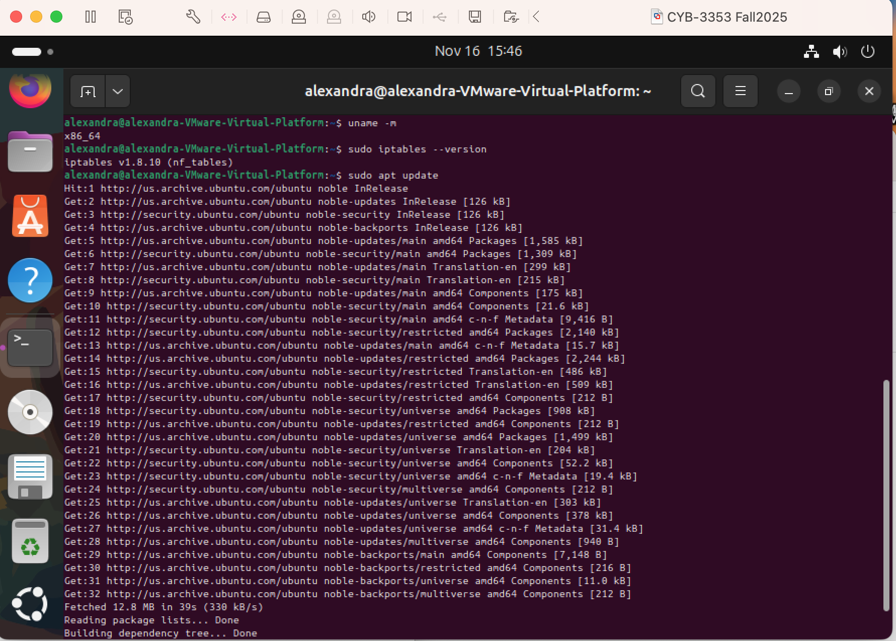
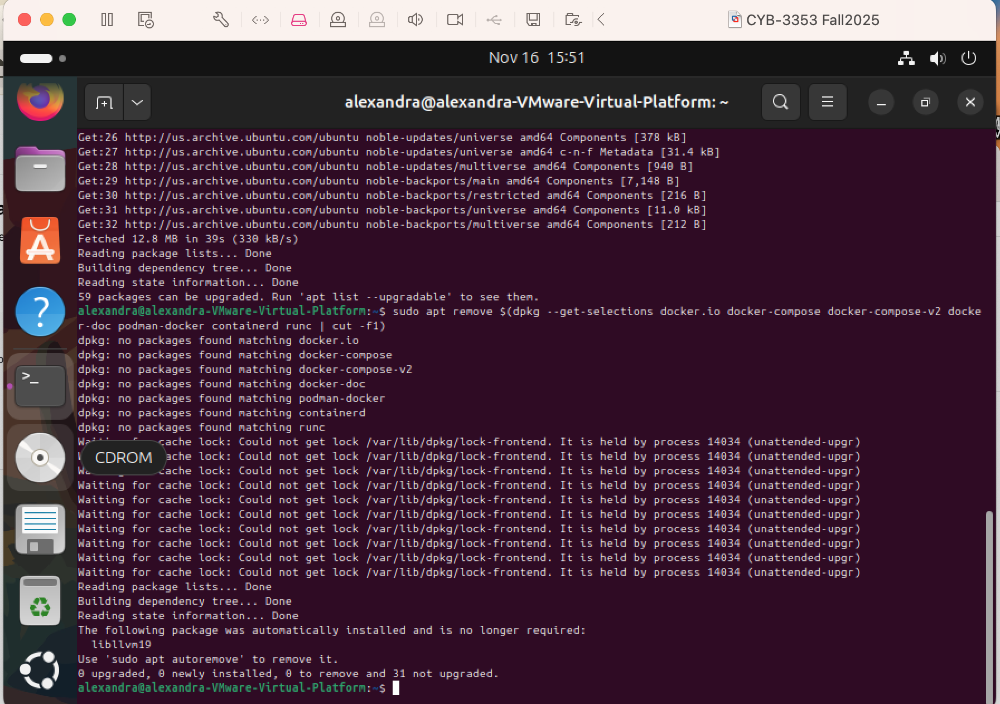
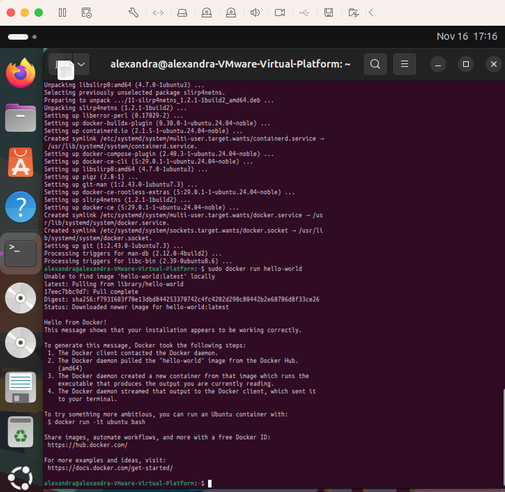
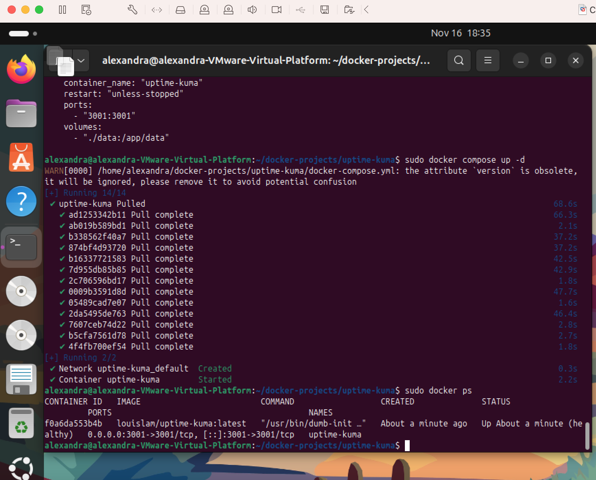
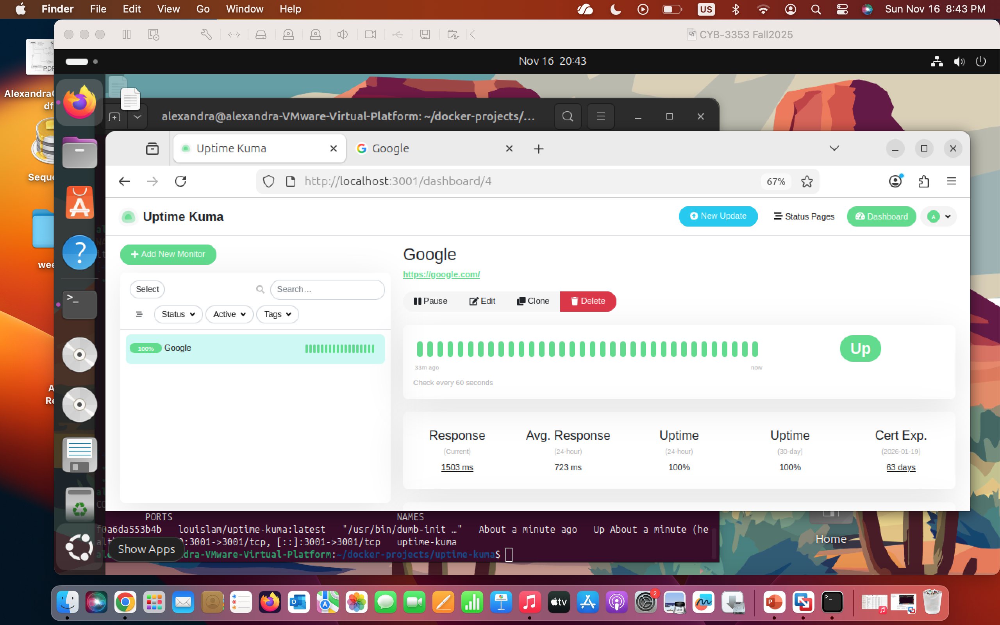

Author: Alexandra Hernandez Gomez
Revision Date: November 16, 2025
What: This documentation explains how I installed Docker Engine and Docker Compose on my Ubuntu 24.04 VM inside VMware Fusion, and deployed the open-source monitoring tool Uptime Kuma using a docker-compose.yml file. 

PART 1 — Prerequisites
Source: https://docs.docker.com/engine/install/

1. Check Firewall Status 
Start by opening a terminal  inside the Ubuntu VM and check your firewall status

    sudo ufw status

Docker requires awareness of firewall behavior. If this returns

    Status: inactive

No action is required

2. Verify Ubuntu Version
   
Docker requires supported versions of Ubuntu (including 22.04 and 24.04). Verified using:

    lsb_release -a

This will return the distributor ID, Description, Release, and Codename.
In the below screenshot we can see  Ubuntu 24.04.3 LTS and the Codename: noble which are  supported by Docker.

3. Verify System Architecture
   
Docker supports 64-bit architectures such as x86_64.

    uname -m

Result: x86_64

4. Check iptables Backend
  
Docker relies on iptables (nf_tables or legacy). Verified with:

    sudo iptables --version

Result: iptables v1.8.x (nf_tables)

A fully supported backend 

5. Update Package Index
   
Before installing or removing anything, updated apt repositories:

    sudo apt update

6. Remove Old or Conflicting Docker Packages
   
To avoid conflicts with the official Docker Engine, attempted to remove any old Ubuntu-supplied Docker packages:

    sudo apt remove $(dpkg --get-selections docker.io docker-compose docker-compose-v2 docker-doc podman-docker containerd runc | cut -f1)

Result:

 No Docker-related packages were installed, so nothing needed removal.

PART 2 — Set Up Docker Apt Repository 
   
1. Install required packages:
   
        sudo apt update

        sudo apt install ca-certificates curl

2. Create keyring directory:
   
        sudo install -m 0755 -d /etc/apt/keyrings

3. Add Docker’s GPG key:
   
        sudo curl -fsSL https://download.docker.com/linux/ubuntu/gpg -o /etc/apt/keyrings/docker.asc

        sudo chmod a+r /etc/apt/keyrings/docker.asc

4. Add Docker repository:
   
        sudo tee /etc/apt/sources.list.d/docker.sources <<EOF
        Types: deb
        URIs: https://download.docker.com/linux/ubuntu
        Suites: $(. /etc/os-release && echo "${UBUNTU_CODENAME:-$VERSION_CODENAME}")
        Components: stable
        Signed-By: /etc/apt/keyrings/docker.asc
        EOF

5. Update apt:
   
        sudo apt update

6. Install Docker Engine, CLI, Compose Plugin, Buildx
   
        sudo apt install docker-ce docker-ce-cli containerd.io docker-buildx-plugin docker-compose-plugin

7. Test Docker Installation

        sudo docker run hello-world

Result:  “Hello from Docker!”

Part 3 — Setting up Uptime Kuma

1. Created a project directory
   
I made a dedicated folder to keep the Compose file and persistent data organized.

    mkdir -p ~/docker-projects/uptime-kuma

    cd ~/docker-projects/uptime-kuma

    mkdir data

2. Created the docker-compose.yml file
  
I manually created a Docker Compose file using correct indentation and YAML format. This was the final working version:

    version: "3.8"

    services:
      uptime-kuma:
        image: "louislam/uptime-kuma:latest"
        container_name: "uptime-kuma"
        restart: "unless-stopped"
        ports:
          - "3001:3001"
        volumes:
          - "./data:/app/data"

Important notes- YAML is sensitive to indentation use only spaces, no tabs.

3. Validated the file
   
To verify the Compose file was written correctly, I displayed it with:

    cat docker-compose.yml

This allowed me to check the alignment and structure.

4. Launched the container with Docker Compose
   
I started the stack using:

    sudo docker compose up -d

5. Verified the container is running
   
I checked the status with:

    sudo docker ps

6. Accessed Uptime Kuma in the browser
   
I opened the application using:

    http://localhost:3001

This loaded the Uptime Kuma setup page, confirming the deployment was successful.I created a new HTTP(s) monitor for https://www.google.com, and it immediately reported UP. The live status graph and green indicator verified that the container was functioning correctly and able to make outbound connections from the VM.

